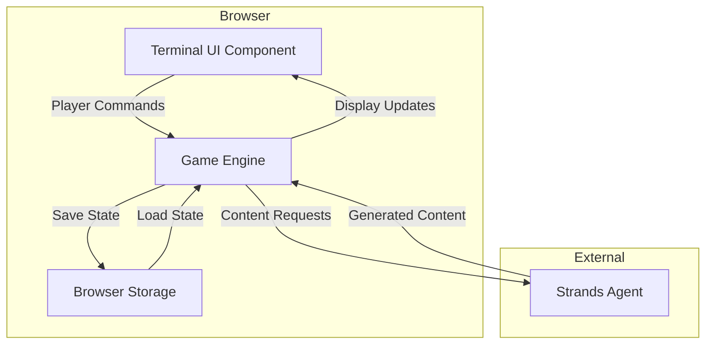

# Design Document: Nature42

## Overview

Nature42 is a browser-based text adventure game that leverages the Strands Agent SDK to create dynamically generated, AI-driven gameplay experiences. The game presents players with a philosophical quest: collect six keys from six different AI-generated worlds to unlock a vault containing a meaningful message about life's purpose.

The system architecture separates concerns into distinct layers:
- **Frontend Layer**: Browser-based terminal UI with retro aesthetics
- **Game Engine Layer**: Core game logic, state management, and command processing
- **AI Agent Layer**: Strands-powered content generation and validation
- **Persistence Layer**: Browser storage for automatic save/restore

The game begins in a consistent starting location (forest clearing with six doors and a vault) but generates unique content dynamically as players explore. Each door leads to a procedurally generated world with its own narrative, puzzles, NPCs, and challenges. The AI adapts content based on player choices, maintains consistency across sessions, and progressively increases difficulty as players collect more keys.

### Deployment

The application will be deployed to **AWS App Runner** using the **Python 3.11 runtime**. Key considerations for App Runner deployment:

- **Port Configuration**: App Runner expects the application to listen on port 8080 (configurable via `PORT` environment variable)
- **Requirements**: Dependencies must be specified in `requirements.txt` at the repository root
- **Start Command**: App Runner will automatically detect Python applications, but a custom start command can be specified in `apprunner.yaml`
- **Health Checks**: The application should expose a health check endpoint (e.g., `/health`) for App Runner to monitor
- **Static Files**: For serving the frontend, static files should be configured appropriately for the web framework used
- **Environment Variables**: Strands Agent SDK credentials and configuration should be provided via App Runner environment variables
- **Build Process**: App Runner will automatically install dependencies from `requirements.txt` during deployment

Reference: [AWS App Runner Python Runtime Documentation](https://docs.aws.amazon.com/apprunner/latest/dg/service-source-code-python.html#service-source-code-python.callouts)

### Strands Agent SDK Integration

The application uses the **Strands Agents SDK** for AI-powered content generation. Key integration details:

**Installation:**
```bash
pip install strands-agents strands-agents-tools
```

**Model Provider:** Amazon Bedrock (default, included in base package)
- Uses Claude 4 Sonnet by default: `anthropic.claude-sonnet-4-20250514-v1:0`
- No additional provider extensions needed for Bedrock

**Authentication:**
- **Development**: Use Bedrock API keys (30-day expiration)
  - Set via environment variable: `AWS_BEDROCK_API_KEY`
  - Generate from Bedrock Console → API keys
- **Production**: Use IAM roles or AWS credentials
  - Set via: `AWS_ACCESS_KEY_ID`, `AWS_SECRET_ACCESS_KEY`, `AWS_REGION`
  - Or configure via `aws configure`

**Model Access:**
- Must enable model access in Bedrock Console before use
- Navigate to: Bedrock Console → Model access → Manage model access
- Enable Claude 4 Sonnet or desired models

**Agent Configuration:**
```python
from strands import Agent
from strands.models import BedrockModel

# Simple configuration (uses defaults)
agent = Agent(
    tools=[custom_tool1, custom_tool2],
    system_prompt="Your system prompt here"
)

# Full configuration
model = BedrockModel(
    model_id="anthropic.claude-sonnet-4-20250514-v1:0",
    region_name="us-west-2",
    temperature=0.7,
    max_tokens=4096,
)

agent = Agent(
    model=model,
    tools=[custom_tool1, custom_tool2],
    system_prompt="Your system prompt here"
)
```

**Best Practices:**
- Use lower temperature (0.1-0.3) for factual content generation
- Use higher temperature (0.7-0.9) for creative narrative generation
- Set `max_tokens=4096` to allow room for tool calls and responses
- Use clear docstrings for custom tools - models read them to understand usage
- Enable prompt caching for long system prompts (1024+ tokens) using `SystemContentBlock` with `cachePoint`
- Test agents immediately after creation with simple queries

## Architecture

### High-Level Architecture



### Frontend Technology Stack

The frontend will use **vanilla HTML/JavaScript/CSS** without frameworks for the following reasons:

- **Simplicity**: Terminal UI is straightforward (text I/O, styling effects)
- **No Build Step**: Easier deployment without webpack/bundling
- **Performance**: Fast initial load, no framework overhead
- **Retro Aesthetic**: Fits vintage terminal vibe naturally
- **Native APIs**: localStorage/IndexedDB work great without abstractions

**Frontend Structure:**
```
static/
├── index.html          # Main page with terminal structure
├── privacy.html        # Privacy policy page
├── terms.html          # User agreement page
├── about.html          # About page
├── css/
│   ├── terminal.css    # Terminal styling and CRT effects
│   ├── themes.css      # Color schemes (amber, green, etc.)
│   └── pages.css       # Styling for legal/info pages
├── js/
│   ├── terminal.js     # Terminal UI logic
│   ├── game-client.js  # Game engine client-side logic
│   └── storage.js      # Browser storage management
└── assets/
    └── images/         # Placeholder images, icons
```

**Key Frontend Features:**
- CSS animations for typing effects
- CSS filters for CRT scanlines and phosphor glow
- Vanilla JS for DOM manipulation and event handling
- Server-Sent Events (SSE) or Fetch Streaming API for real-time response streaming
- IndexedDB for game state persistence

**Technology Choices:**
- **Backend Framework**: FastAPI (async support, streaming, automatic docs)
  - Note: Use Context7 MCP server to access latest FastAPI documentation during implementation
- **Streaming Protocol**: Server-Sent Events (SSE) via Fetch Streaming API
- **Static Serving**: FastAPI StaticFiles middleware
- **State Storage**: IndexedDB (client-side) with optional server backup

### Component Responsibilities

**Terminal UI Component (Browser)**
- Renders retro-styled terminal interface with CRT effects
- Handles player input with typing animations
- Displays text output with simulated typing effect
- Manages accessibility mode toggle
- Renders AI-generated location images
- Receives streamed responses via EventSource API

**Game Engine (Server - Python/FastAPI)**
- Processes natural language commands
- Maintains game state (location, inventory, keys, world data)
- Coordinates with AI agent for content generation and validation
- Implements game rules and mechanics
- Manages state persistence to browser storage
- Tracks player decision history
- Streams responses to client using Server-Sent Events

**Strands Agent (Server - Strands SDK)**
- Generates location descriptions and narratives
- Creates location imagery
- Validates player actions for contextual appropriateness
- Generates NPC dialogue with memory of past interactions
- Creates puzzles with multiple solution paths
- Evaluates creative puzzle solutions
- Adapts content based on player history

**Browser Storage Manager (Browser)**
- Serializes/deserializes game state
- Automatically saves on state changes
- Restores state on game load
- Handles corrupted data gracefully

### Client-Server Communication

**Web Framework: FastAPI**
- Modern Python web framework with async support
- Native support for streaming responses
- Automatic API documentation
- Easy deployment to AWS App Runner
- Serves static files (HTML, CSS, JS)

**API Endpoints:**

```python
# Static file serving
GET /                          # Serve index.html
GET /static/{path}             # Serve CSS, JS, images
GET /privacy                   # Privacy policy page
GET /terms                     # User agreement page
GET /about                     # About page

# Game API
POST /api/command              # Process player command (streaming response)
GET /api/state                 # Get current game state
POST /api/state                # Save game state
DELETE /api/state              # Clear game state (new game)
GET /api/health                # Health check for App Runner
```

**Streaming Protocol: Server-Sent Events (SSE)**

Server-side (FastAPI with Strands):
```python
from fastapi import FastAPI
from fastapi.responses import StreamingResponse
from pydantic import BaseModel
from strands import Agent
import json

class CommandRequest(BaseModel):
    command: str
    game_state: dict

@app.post("/api/command")
async def process_command(request: CommandRequest):
    async def generate():
        # Initialize agent with game context
        agent = Agent(
            tools=[custom_tools],
            system_prompt=build_system_prompt(request.game_state),
            callback_handler=None  # Required for stream_async
        )
        
        try:
            # Stream agent response using stream_async
            async for event in agent.stream_async(request.command):
                # Send text chunks to client
                if "data" in event:
                    yield f"data: {json.dumps({'text': event['data']})}\n\n"
                
                # Send tool usage events
                if "current_tool_use" in event:
                    tool_name = event["current_tool_use"].get("name")
                    if tool_name:
                        yield f"data: {json.dumps({'tool': tool_name})}\n\n"
                
                # Send final result
                if "result" in event:
                    yield f"data: {json.dumps({'done': True, 'result': event['result']})}\n\n"
        except Exception as e:
            yield f"data: {json.dumps({'error': str(e)})}\n\n"
    
    return StreamingResponse(
        generate(),
        media_type="text/event-stream",
        headers={
            "Cache-Control": "no-cache",
            "Connection": "keep-alive",
        }
    )
```

Client-side (JavaScript with EventSource):
```javascript
async function sendCommand(command, gameState) {
    const response = await fetch('/api/command', {
        method: 'POST',
        headers: {'Content-Type': 'application/json'},
        body: JSON.stringify({command, game_state: gameState})
    });
    
    const reader = response.body.getReader();
    const decoder = new TextDecoder();
    
    while (true) {
        const {done, value} = await reader.read();
        if (done) break;
        
        const chunk = decoder.decode(value);
        const lines = chunk.split('\n');
        
        for (const line of lines) {
            if (line.startsWith('data: ')) {
                const data = JSON.parse(line.slice(6));
                
                if (data.text) {
                    displayText(data.text);  // Incrementally display
                } else if (data.tool) {
                    showToolUsage(data.tool);
                } else if (data.done) {
                    handleComplete(data.result);
                    return;
                } else if (data.error) {
                    handleError(data.error);
                    return;
                }
            }
        }
    }
}
```

**Asset Serving:**
- Static files served by FastAPI's `StaticFiles` middleware
- HTML pages served via `FileResponse` or templates
- Images (location images) served from `/static/images/` or external URLs
- CSS/JS bundled and served from `/static/css/` and `/static/js/`

**State Management:**
- Client maintains game state in IndexedDB
- Periodic sync to server (optional backup)
- Server can reconstruct state from client on each request
- Stateless server design for easier scaling

## Components and Interfaces

### Game State Model

```python
@dataclass
class GameState:
    """Complete state of the game"""
    player_location: str  # Current location ID
    inventory: List[Item]
    keys_collected: List[int]  # Door numbers (1-6)
    visited_locations: Dict[str, LocationData]
    npc_interactions: Dict[str, List[Interaction]]
    puzzle_states: Dict[str, PuzzleState]
    decision_history: List[Decision]
    current_door: Optional[int]  # Which door world player is in (None = clearing)
    game_started_at: datetime
    last_updated: datetime

@dataclass
class LocationData:
    """Cached data for a generated location"""
    id: str
    description: str
    image_url: str
    exits: List[str]
    items: List[Item]
    npcs: List[str]
    generated_at: datetime

@dataclass
class Item:
    """An item in the game"""
    id: str
    name: str
    description: str
    is_key: bool
    door_number: Optional[int]  # If is_key, which door it belongs to
    properties: Dict[str, Any]  # Flexible properties for AI evaluation

@dataclass
class Interaction:
    """Record of player-NPC interaction"""
    timestamp: datetime
    npc_id: str
    player_action: str
    npc_response: str
    sentiment: str  # positive, neutral, negative

@dataclass
class PuzzleState:
    """State of a puzzle"""
    puzzle_id: str
    description: str
    solved: bool
    attempts: List[str]
    hints_given: int

@dataclass
class Decision:
    """Significant player choice"""
    timestamp: datetime
    location_id: str
    description: str
    consequences: List[str]
```

### Command Processing Interface

```python
class CommandProcessor:
    """Processes natural language player commands"""
    
    def __init__(self, agent: StrandsAgent, game_state: GameState):
        self.agent = agent
        self.game_state = game_state
    
    async def process_command(self, command: str) -> CommandResult:
        """
        Parse and execute a player command
        
        Returns CommandResult with:
        - success: bool
        - message: str (response to player)
        - state_changes: List[StateChange]
        - needs_clarification: bool
        """
        pass
    
    async def _parse_intent(self, command: str) -> Intent:
        """Use AI to determine player intent"""
        pass
    
    async def _validate_action(self, intent: Intent) -> ValidationResult:
        """Check if action is valid in current context"""
        pass
    
    async def _execute_action(self, intent: Intent) -> ActionResult:
        """Perform the action and update state"""
        pass
```

### Content Generation Interface

```python
class ContentGenerator:
    """Handles AI-driven content generation"""
    
    def __init__(self, agent: StrandsAgent):
        self.agent = agent
        self.content_filter = ContentFilter(age_rating="13+")
    
    async def generate_location(
        self,
        door_number: int,
        player_history: List[Decision],
        keys_collected: int
    ) -> LocationData:
        """Generate a new location with appropriate difficulty"""
        pass
    
    async def generate_location_image(
        self,
        description: str
    ) -> str:
        """Generate image URL for location with content filtering"""
        pass
    
    async def _validate_content_appropriateness(
        self,
        content: str
    ) -> bool:
        """Validate content is appropriate for 13+ audience"""
        pass
    
    async def generate_npc_dialogue(
        self,
        npc_id: str,
        player_action: str,
        interaction_history: List[Interaction]
    ) -> str:
        """Generate NPC response considering past interactions"""
        pass
    
    async def generate_puzzle(
        self,
        difficulty: int,
        theme: str,
        required_virtues: List[str]
    ) -> Puzzle:
        """Create a puzzle requiring specific virtues (kindness, courage, etc.)"""
        pass
    
    async def evaluate_puzzle_solution(
        self,
        puzzle: Puzzle,
        attempt: str,
        inventory: List[Item]
    ) -> EvaluationResult:
        """Determine if creative solution is valid"""
        pass
    
    async def generate_hint(
        self,
        puzzle: Puzzle,
        keys_collected: int,
        previous_hints: List[str]
    ) -> str:
        """Generate hint with appropriate specificity"""
        pass
```

### Storage Interface

```python
class StorageManager:
    """Manages browser storage persistence"""
    
    def __init__(self, storage_type: str = "indexeddb"):
        self.storage_type = storage_type
    
    async def save_state(self, state: GameState) -> bool:
        """Serialize and save game state"""
        pass
    
    async def load_state(self) -> Optional[GameState]:
        """Load and deserialize game state"""
        pass
    
    async def clear_state(self) -> bool:
        """Delete saved game"""
        pass
    
    def _serialize(self, state: GameState) -> str:
        """Convert state to JSON"""
        pass
    
    def _deserialize(self, data: str) -> GameState:
        """Parse JSON to state object"""
        pass
```

## Data Models

### World Structure

The game maintains a two-tier world structure:

1. **Hub World (Forest Clearing)**: Static, consistent across all playthroughs
   - Six numbered doors (1-6)
   - Central vault with six keyholes
   - Twilight atmosphere
   - No procedural generation

2. **Door Worlds**: Dynamically generated per playthrough
   - Each door leads to unique world
   - Worlds persist once generated (stored in GameState)
   - Progressive difficulty based on door number
   - Contains locations, NPCs, items, puzzles

### Difficulty Progression Model

```python
DIFFICULTY_CURVE = {
    1: {
        "target_time_minutes": 7.5,  # 5-10 min range
        "puzzle_complexity": "simple",
        "world_size": "small",  # 3-5 locations
        "hint_generosity": "high",
        "required_virtues": ["kindness"]
    },
    2: {
        "target_time_minutes": 15,
        "puzzle_complexity": "moderate",
        "world_size": "medium",  # 5-8 locations
        "hint_generosity": "high",
        "required_virtues": ["curiosity"]
    },
    3: {
        "target_time_minutes": 30,
        "puzzle_complexity": "moderate",
        "world_size": "medium",
        "hint_generosity": "medium",
        "required_virtues": ["courage"]
    },
    4: {
        "target_time_minutes": 45,
        "puzzle_complexity": "complex",
        "world_size": "large",  # 8-12 locations
        "hint_generosity": "medium",
        "required_virtues": ["gratitude"]
    },
    5: {
        "target_time_minutes": 75,
        "puzzle_complexity": "complex",
        "world_size": "large",
        "hint_generosity": "low",
        "required_virtues": ["kindness", "curiosity"]
    },
    6: {
        "target_time_minutes": 150,  # 2-3 hours
        "puzzle_complexity": "very_complex",
        "world_size": "very_large",  # 12-20 locations
        "hint_generosity": "minimal",
        "required_virtues": ["kindness", "curiosity", "courage", "gratitude"]
    }
}
```

### Pop Culture Reference Database

The system maintains a curated database of pop culture references organized by decade:

```python
POP_CULTURE_REFS = {
    "1970s": ["Holy Hand Grenade", "disco ball", "pet rock", ...],
    "1980s": ["DeLorean", "Rubik's Cube", "Walkman", ...],
    "1990s": ["Beanie Babies", "Tamagotchi", "pager", ...],
    "2000s": ["flip phone", "iPod", "MySpace", ...],
    "2010s": ["fidget spinner", "selfie stick", "dabbing", ...],
    "2020s": ["Among Us", "sourdough starter", "Zoom fatigue", ...]
}
```

The AI agent selects references contextually based on the generated world theme.

## Data Models (continued)

### Terminal UI State

```python
@dataclass
class TerminalState:
    """UI-specific state"""
    output_buffer: List[OutputLine]
    input_history: List[str]
    crt_effects_enabled: bool
    accessibility_mode: bool
    current_image_url: Optional[str]
    typing_animation_speed: int  # ms per character

@dataclass
class OutputLine:
    """A line of terminal output"""
    text: str
    timestamp: datetime
    style: str  # "normal", "system", "error", "success"
```


## Correctness Properties

*A property is a characteristic or behavior that should hold true across all valid executions of a system—essentially, a formal statement about what the system should do. Properties serve as the bridge between human-readable specifications and machine-verifiable correctness guarantees.*

### Property 1: Command parsing produces intent
*For any* text command entered by the player, the command processor should successfully parse it and produce an Intent object (which may indicate ambiguity or invalidity).
**Validates: Requirements 1.1**

### Property 2: Ambiguous commands request clarification
*For any* command that the system identifies as ambiguous, the response should request clarification from the player.
**Validates: Requirements 1.2**

### Property 3: Invalid commands provide helpful feedback
*For any* command that the system identifies as invalid, the response should include helpful feedback suggesting valid alternatives.
**Validates: Requirements 1.3**

### Property 4: Pop culture references in generated content
*For any* generated location description, it should contain at least one reference from the pop culture database spanning 1970s-2025.
**Validates: Requirements 2.3, 9.1**

### Property 5: Location description consistency
*For any* location, visiting it multiple times should return the same description (idempotence property).
**Validates: Requirements 2.4**

### Property 6: Generated locations have multiple exits
*For any* generated location, it should have at least two exits or interaction points.
**Validates: Requirements 2.5**

### Property 7: Inventory round-trip consistency
*For any* item in a location, picking it up then dropping it should result in the item being back in the location and not in inventory (round-trip property).
**Validates: Requirements 3.1, 3.5**

### Property 8: Invalid item pickup produces error
*For any* item name that does not exist in the current location, attempting to pick it up should produce an error message informing the player.
**Validates: Requirements 3.2**

### Property 9: Inventory view shows all items
*For any* inventory state, viewing the inventory should display all items currently held.
**Validates: Requirements 3.3**

### Property 10: Puzzles accept multiple solutions
*For any* generated puzzle, at least two distinct solution attempts should be accepted as valid.
**Validates: Requirements 4.1**

### Property 11: Solved puzzles provide feedback and update state
*For any* puzzle, when solved, the system should provide positive feedback and update the puzzle_states to mark it as solved.
**Validates: Requirements 4.3, 4.5**

### Property 12: Game state serialization round-trip
*For any* game state, serializing it to storage and then deserializing should produce an equivalent game state with all fields intact (location descriptions, inventory, keys collected, puzzle states).
**Validates: Requirements 5.1, 5.2, 5.3**

### Property 13: Corrupted storage handled gracefully
*For any* corrupted or invalid storage data, the system should inform the player and offer to start a new game without crashing.
**Validates: Requirements 5.5**

### Property 14: Accessibility mode disables effects
*For any* terminal state, when accessibility mode is enabled, visual effects (CRT effects, animations) should be disabled while core functionality remains operational.
**Validates: Requirements 7.4**

### Property 15: NPC interactions recorded in state
*For any* interaction with an NPC, the interaction should be recorded in the npc_interactions dictionary in the game state.
**Validates: Requirements 8.1, 8.5**

### Property 16: Artifacts have era associations
*For any* artifact item, it should have an associated era (1970s-2020s) and pop culture element.
**Validates: Requirements 9.3**

### Property 17: Significant choices recorded in history
*For any* significant player choice, it should be added to the decision_history in the game state.
**Validates: Requirements 10.5**

### Property 18: Action validation considers context
*For any* player action, the validation process should receive and consider the current location, inventory, and game state when determining validity, and should provide appropriate feedback (execution for valid actions, explanation for invalid actions).
**Validates: Requirements 12.1, 12.2, 12.3**

### Property 19: Door opening generates world
*For any* door number (1-6), opening it should generate a world with at least one location if it hasn't been opened before.
**Validates: Requirements 13.3**

### Property 20: Key insertion into vault
*For any* key retrieved from a door, it should be insertable into the corresponding numbered keyhole in the vault.
**Validates: Requirements 13.5**

### Property 21: Difficulty increases with door number
*For any* two doors where door A has a lower number than door B, the difficulty parameters for door A should be less than or equal to those for door B (monotonic property).
**Validates: Requirements 13.7**

### Property 22: Hint availability based on keys collected
*For any* hint request when 0-1 keys are collected, a hint should be provided without reluctance messages.
**Validates: Requirements 14.1, 14.4**

### Property 23: Shareable content includes required fields
*For any* generated shareable content, it should include the location image, description, and number of keys collected.
**Validates: Requirements 15.1, 15.2, 15.3**

### Property 24: Share codes are unique
*For any* two share requests, they should generate distinct share codes.
**Validates: Requirements 15.4**

### Property 25: Shares exclude puzzle solutions
*For any* shareable content, it should not contain puzzle solutions or other spoiler information from puzzle_states.
**Validates: Requirements 15.5**

### Property 26: Generated content is age-appropriate
*For any* AI-generated content (text or images), it should pass age-appropriateness validation for 13+ audience, excluding violence, explicit language, sexual content, and mature themes.
**Validates: Requirements 16.1, 16.2, 16.3, 16.4**

### Property 27: Footer contains required links and copyright
*For any* page load, the footer should contain links to Privacy Policy, User Agreement, and About pages, plus a copyright notice "© 2025".
**Validates: Requirements 17.1, 17.6**

### Property 28: Server streams responses to client
*For any* AI-generated response, the server should stream output chunks to the client as they are generated, and the client should display them incrementally.
**Validates: Requirements 18.1, 18.2**

## Error Handling

### Command Processing Errors
- **Ambiguous Commands**: Request clarification with examples of possible interpretations
- **Invalid Commands**: Provide helpful suggestions based on current context
- **Timeout Errors**: Display user-friendly message and allow retry
- **AI Service Unavailable**: Show error and prevent gameplay until connection restored

### State Management Errors
- **Corrupted Save Data**: Detect during deserialization, inform player, offer new game
- **Storage Quota Exceeded**: Warn player and attempt to compress or clean old data
- **Serialization Failures**: Log error, attempt recovery, fallback to last known good state

### Content Generation Errors
- **Image Generation Failure**: Display placeholder image, log error, continue gameplay
- **Description Generation Failure**: Use fallback template, retry in background
- **Invalid AI Output**: Validate and sanitize, regenerate if necessary
- **Inappropriate Content Detected**: Regenerate content with stricter age-appropriate guidelines, log incident for review

### Network Errors
- **Connection Loss**: Queue actions locally, sync when connection restored
- **API Rate Limiting**: Implement exponential backoff, inform player of delays
- **Timeout**: Retry with exponential backoff up to 3 attempts

### Validation Errors
- **Invalid Game State**: Detect inconsistencies, attempt repair, offer rollback to previous save
- **Missing Required Data**: Use sensible defaults, log warning, continue gameplay

## Testing Strategy

### Unit Testing Approach

Unit tests will verify specific examples and edge cases for core functionality:

**Command Processing**
- Test parsing of common commands ("go north", "take key", "examine vault")
- Test handling of empty input
- Test handling of very long input strings
- Test special characters in commands

**State Management**
- Test initialization of new game state
- Test state updates for specific actions
- Test edge cases (empty inventory, all keys collected)

**Storage**
- Test serialization of minimal game state
- Test serialization of complex game state with many locations
- Test handling of corrupted JSON data
- Test storage quota scenarios

**UI Components**
- Test terminal output formatting
- Test accessibility mode toggle
- Test image display with valid/invalid URLs

### Property-Based Testing Approach

Property-based tests will verify universal properties across many randomly generated inputs using the **Hypothesis** library for Python. Each test will run a minimum of 100 iterations.

**Test Configuration**
```python
from hypothesis import given, settings
import hypothesis.strategies as st

# Configure for minimum 100 iterations
@settings(max_examples=100)
```

**Command Processing Properties**
- Property 1: Generate random text strings, verify Intent objects are produced
- Property 2: Generate ambiguous commands, verify clarification requests
- Property 3: Generate invalid commands, verify helpful feedback

**Location Generation Properties**
- Property 4: Generate random locations, verify pop culture references present
- Property 5: Generate location, visit twice, verify descriptions match
- Property 6: Generate random locations, verify ≥2 exits

**Inventory Properties**
- Property 7: Generate random items and locations, test pick-up/drop round-trip
- Property 8: Generate random non-existent item names, verify error messages
- Property 9: Generate random inventory states, verify all items displayed

**Puzzle Properties**
- Property 10: Generate random puzzles, verify multiple solutions accepted
- Property 11: Generate random puzzles, solve them, verify feedback and state update

**Serialization Properties**
- Property 12: Generate random game states, test serialization round-trip
- Property 13: Generate corrupted data, verify graceful handling

**State Tracking Properties**
- Property 15: Generate random NPC interactions, verify recording
- Property 17: Generate random player choices, verify history tracking
- Property 18: Generate random actions with various contexts, verify validation

**Game Mechanics Properties**
- Property 19: Generate door openings, verify world generation
- Property 20: Generate keys, verify vault insertion
- Property 21: Generate door pairs, verify difficulty monotonicity
- Property 22: Generate hint requests with various key counts, verify availability

**Sharing Properties**
- Property 23: Generate random shareable content, verify required fields
- Property 24: Generate multiple shares, verify unique codes
- Property 25: Generate shares with puzzle data, verify exclusion of solutions

**Content Safety Properties**
- Property 26: Generate random content, verify age-appropriateness validation passes

### Integration Testing

Integration tests will verify end-to-end workflows:
- Complete game flow from start to first key collection
- Save and restore game state across browser sessions
- Full door exploration cycle
- Vault opening with all six keys

### Test Data Generation

For property-based tests, we'll use Hypothesis strategies:

```python
# Strategy for generating game states
@st.composite
def game_state_strategy(draw):
    return GameState(
        player_location=draw(st.text(min_size=1, max_size=50)),
        inventory=draw(st.lists(item_strategy(), max_size=20)),
        keys_collected=draw(st.lists(st.integers(min_value=1, max_value=6), unique=True)),
        visited_locations=draw(st.dictionaries(st.text(), location_data_strategy())),
        npc_interactions=draw(st.dictionaries(st.text(), st.lists(interaction_strategy()))),
        puzzle_states=draw(st.dictionaries(st.text(), puzzle_state_strategy())),
        decision_history=draw(st.lists(decision_strategy())),
        current_door=draw(st.one_of(st.none(), st.integers(min_value=1, max_value=6))),
        game_started_at=draw(st.datetimes()),
        last_updated=draw(st.datetimes())
    )
```

### Testing AI-Generated Content

Since AI-generated content is non-deterministic, we focus on:
- **Structural validation**: Verify output format and required fields
- **Constraint validation**: Verify outputs meet specified constraints (length, references, etc.)
- **Consistency validation**: Verify same inputs produce consistent results when cached
- **Boundary testing**: Test with edge cases (empty context, maximum complexity)

We do NOT test:
- Subjective quality (humor, tone, creativity)
- Exact content matching (since AI is non-deterministic)
- Time-based requirements (completion time for puzzles)

